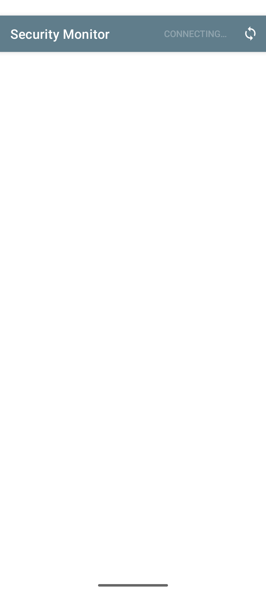
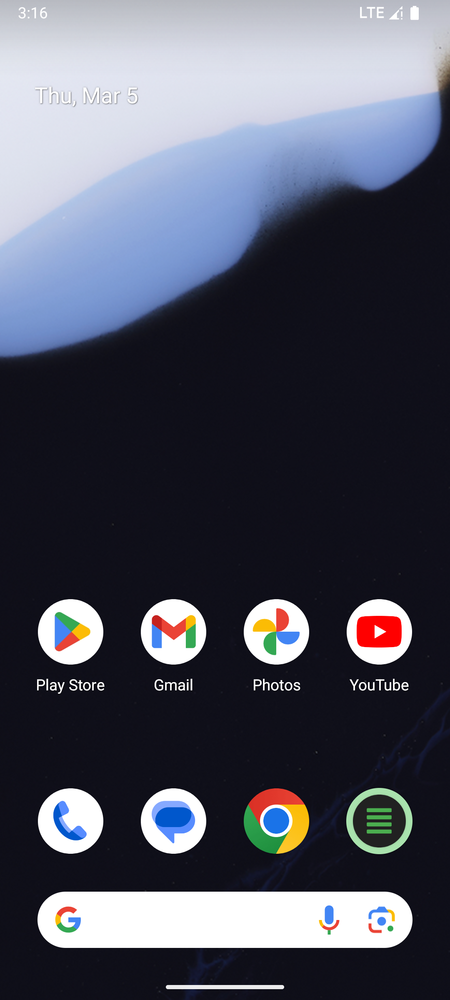

# Security Monitor

A lightweight Python tool that analyzes raw Android logcat output (via ADB) to detect suspicious activity on a mobile device — no root required.

## Features

- **Real-time monitoring** via live ADB logcat stream
- **Batch analysis** of saved log files
- **12 built-in detection rules** — root access, Frida/Xposed hooks, ransomware, SMS trojans, crypto mining, SSL pinning bypass, and more
- **Frequency anomaly detection** — sliding 60-second window per tag
- **Entropy analysis** — flags high-entropy payloads (base64/encrypted exfil)
- **Risk scoring** — exponential decay formula, 0–100, mapped to LOW / MEDIUM / HIGH
- **Alert suppression** — same rule silenced for 60 seconds to avoid noise
- **Web dashboard** — auto-refreshing Flask UI at `localhost:5000` (optional)
- **No root required** — connects to the ADB daemon over TCP

## Screenshots

| Dashboard | Threat Feed |
|---|---|
|  |  |

## Quick Start

### 1. One-time ADB Setup (with USB connected)

Enable USB debugging on your phone:
- Go to **Settings → About Phone** and tap **Build number** 7 times
- Go back to **Settings → Developer Options** and enable **USB debugging**

Then run on your PC (with the phone plugged in via USB):

```bash
adb tcpip 5555
```

Unplug the USB cable. The phone will now accept ADB over Wi-Fi.

> **Note:** You must repeat this after each device reboot.

### 2. Install & Run

```bash
git clone https://github.com/aryanchauhanoffical/Security-Monitor.git
cd Security-Monitor

# Optional — only needed for the web dashboard
pip install flask

# Live monitoring (terminal output)
python monitor.py

# Live monitoring + web dashboard at http://localhost:5000
python monitor.py --web

# Analyze a saved log file
python monitor.py --file dump.txt

# Target a specific device
python monitor.py --device 192.168.1.42:5555
```

### Windows PowerShell (ADB path)

```powershell
& "$env:LOCALAPPDATA\Android\Sdk\platform-tools\adb.exe" tcpip 5555
```

## Detection Rules

| Rule | Severity | Score |
|---|---|---|
| Root Access Attempt | HIGH | 85 |
| Frida / Xposed Hooking Framework | CRITICAL | 95 |
| App Installed from Unknown Sources | MEDIUM | 65 |
| Certificate Pinning Bypass | HIGH | 80 |
| Background Camera / Microphone Access | HIGH | 78 |
| ADB Command Abuse | HIGH | 75 |
| Rapid SMS Sending | HIGH | 80 |
| GPS Access from Background Process | MEDIUM | 60 |
| Crypto Mining Indicator | MEDIUM | 65 |
| Ransomware File Encryption Pattern | HIGH | 88 |
| Network Data Exfiltration | HIGH | 72 |
| Security Exception Storm | MEDIUM | 45 |

Rules are loaded from `rules.json` at startup. You can add or modify rules without touching the code.

## Risk Scoring

```
Score = Σ event.score × engine_weight × e^(-0.005 × age_seconds)

engine_weight: RULE=1.0  FREQ=0.7  ENTROPY=0.75

LOW     0–29   (green)
MEDIUM  30–69  (amber)
HIGH    70–100 (red)
```

Events older than 5 minutes are evicted from the scoring window.

## CLI Options

```
python monitor.py [options]

  -d, --device SERIAL   ADB device serial (see: adb devices)
  -f, --file   FILE     Batch logcat file to analyze
  -r, --rules  FILE     Detection rules JSON (default: rules.json)
  -w, --web             Start web dashboard at localhost:5000
  -p, --port   PORT     Dashboard port (default: 5000)
```

## Project Structure

```
Security-Monitor/
├── monitor.py        # Main monitoring script
├── rules.json        # Detection rules (editable)
├── requirements.txt  # Optional deps (flask)
└── README.md
```

## Requirements

- Python 3.10+
- `adb` in your PATH ([Android SDK Platform Tools](https://developer.android.com/tools/releases/platform-tools))
- `flask` (only for `--web` dashboard)

## License

Apache License, Version 2.0
